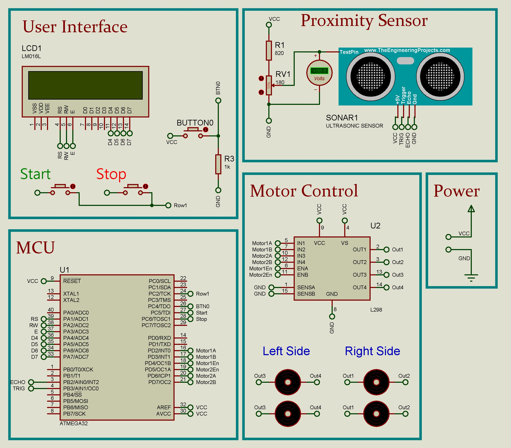

# Obstacle Avoidance Car
#### Embedded SW Design
#### Author: Team 1
- #### Members:
    - Ahmed Hesham
    - Sarah Mohamed
    - Alaa Hisham
    - Hossam Elwahsh

## Brief
> This project aims to design a collision avoidance system for a four-wheel drive robot. By implementing intelligent sensing and control mechanisms, the system enables the robot to detect and avoid obstacles in its path, ensuring safe navigation.

## Quick Links
> - `Project Documentation`
    >     👉 [PDF](Documents/Obstacle%20Avoidance%20Car%20-%20Team%201.pdf)
    >     👉 [Google Docs](https://docs.google.com/document/d/16uuhubi2graTcfyTHd0PIQihEIsMuAf3cQ7XSO92o3k/edit#)
> - `Video` 👉 [Youtube](https://youtu.be/5b-M8Epj4_I)
> - `Team Backlog/Test Protocol` 👉 [Google Sheets](https://docs.google.com/spreadsheets/d/1zNYQwJDrJ9qqAZZ_Uy99j_71yp0KEJW7-AQn8Z2eghk/edit?usp=sharing) 👉 [Excel](Documents/Obstacle%20Avoidance%20Car%20-%20Team%201.xlsx)
> - ---
> ### Technical
> - `Proteus Simulation (Proteus 8.13)` 👉 [Proteus.pdsprj](Simulation/ObstacleAvoidanceRobot.pdsprj)
> #### for older proteus version you can import the proteus clip file (pdsclip) and update the MC hex file:
> - `Proteus clip file` 👉 [Proteus PDSCLIP](Simulation/sim(for%20old%20versions).pdsclip)
> - `APP Hex` 👉 [ObstacleAvoidanceCar.hex](Simulation/ObstacleAvoidanceCar.hex)

---------

## Circuit Schematic

